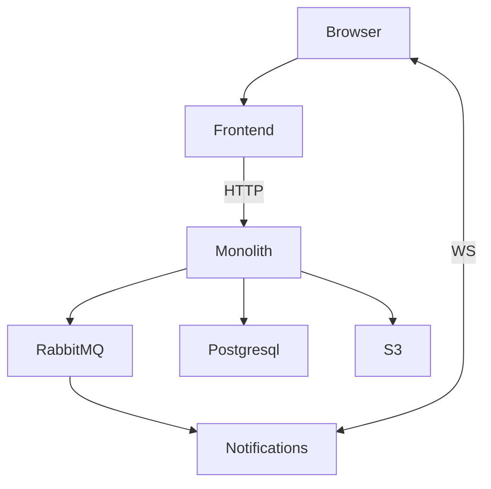

# Nosebook
Пет-проект, который дал мне возможность познакомиться с языком Go.
Проект задеплоен и его можно потрогать здесь: http://nosebook.ru (есть вероятность что виртуальная машина выключится в любой момент времени, так как все это крутится на самом дешевом тарифе в Yandex Cloud)

User                       |  Messages                   | Friends
:-------------------------:|:---------------------------:|:-----
   |    |    

### Фичи, реализованные на данный момент
##### Пользователи:
- [x] Регистрация пользователя
- [x] Логин пользователя
- [x] Поиск пользователя по тексту
- [x] Отображение онлайн-статуса пользователя
- [x] Обновление аватарки пользователя
##### Мессаджинг:
- [x] Приватные 1-1 чаты
- [x] Уведомления о новых сообщениях через Websocket
- [ ] Групповые чаты
##### Дружба:
- [x] Добавление друга
- [x] Удаление друга
- [x] Просмотр друзей
- [ ] Уведомления о новых заявках через Websocket
##### Посты:
- [x] Публикация поста
- [x] Удаление поста
##### Комментарии:
- [x] Публикация комментария
- [x] Удаление комментария
##### Лайки:
- [x] Лайк постов
- [x] Уведомления автора поста о новом лайке через Websocket
- [x] Лайк комментариев
- [x] Уведомления автора комментария о новом лайке через Websocket

### Общая архитектура
Стек: 
- Go
- Postgresql
- RabbitMQ
- Yandex Cloud S3
- Prometheus
- Jaeger
- Grafana (http://nosebook.ru:3000, username: public, password: public)

Фронт:
- Typescript
- NextJS

Система представляет из себя монолит и сервис нотификаций.
Монолит содержит в себе всю функциональность.
Сервис нотификаций отвечает за отправку сообщений пользователю по websocket.
Монолит общается с нотификациями через RabbitMQ.

### Observability
- Prometheus
- Jaeger
- Grafana (http://nosebook.ru:3000, username: public, password: public)

Подключены экспортеры для RabbitMQ и Postgresql.
Так же пишутся метрики приложения [ссылка на дашборд](http://nosebook.ru:3000/d/adxbcuqmtnl6od/application?orgId=1&refresh=5s)
### Тестирование
Сейчас есть только E2E тесты, покрыта большая часть функциональности ([ссылка](https://github.com/PickNRolls/nosebook/tree/dev/http_tests))

И немного сценариев нагрузочного тестирования ([ссылка](https://github.com/PickNRolls/nosebook/tree/dev/load_tests))
